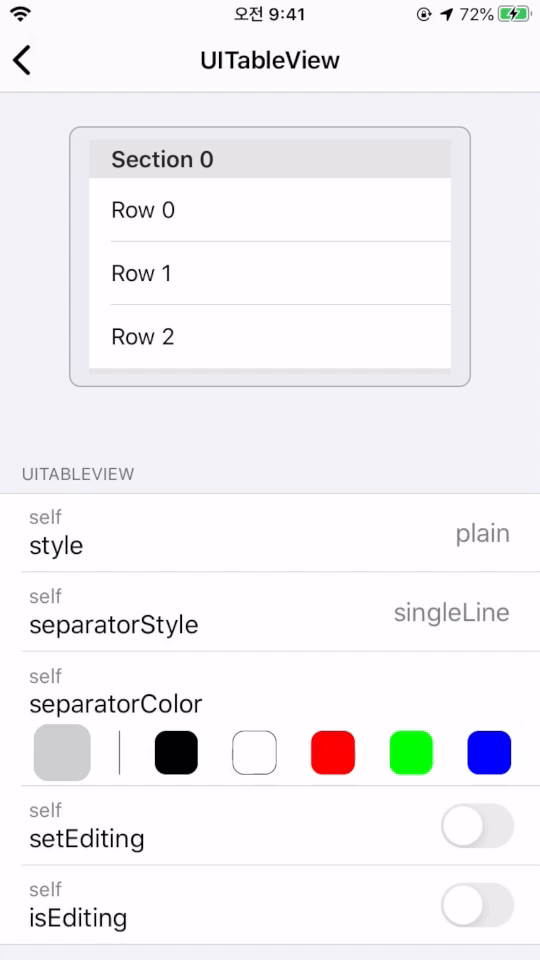

# UIKit Viewer

> 패스트캠퍼스 iOS School에서 진행했던 자체 해커톤 프로젝트 입니다. 기능 보완 후 AppStore에 출시 되었습니다.

<a href="https://apps.apple.com/kr/app/uikitviewer/id1509137201?mt=8" style="display:inline-block;overflow:hidden;background:url(https://linkmaker.itunes.apple.com/ko-kr/badge-lrg.svg?releaseDate=2020-04-21&kind=iossoftware&bubble=ios_apps) no-repeat;width:135px;height:40px;"></a>

## Description

> UIKit Framework에 있는 UI 객체들의 속성과, 그 속성을 변경했을 때 UI 변화를 관찰할 수 있는 공부용 앱 

- Duration : 2020.02.05 ~ 2020.02.07
- Skills : Swift, MVC
- Members : 2명 (LoC<sup id="sup1">[1](#footnote1)</sup> 90%)
- Part : 핵심 기능 개발
- Description
  - iOS 개발을 처음 배우는 사람들이 **'UIKit에서 사용할 수 있는 객체들에 어떤 것이 있는지'** 쉽게 찾아보고 Xcode 없이도 스마트폰에서 간단하게 UI 개발을 연습할 수 있도록 개발
  - UI 객체의 속성값을 조절하면 실시간으로 UI가 변화하여 **'어떤 UI의 어떤 속성을 어떻게 설정하면 어떤 모습으로 변한다'** 는 것을 한눈에 관찰할 수 있다
  - 각 UI에서 더 다양한 property를 설정할 수 있도록 controller를 추가하고 UX를 향상시키는 등 보완해 나갈 계획

## Implementation

- `UIButton`과 `UIImageView`
  
	<p>
		
		
	</p>
  
- `UITableView`과 `UICollectionView`

  <p>
    
    
  </p>

## Trouble Shooting

- 각 UI 객체마다 property의 성격과 특징을 고려해서 값을 조절하는 control의 종류를 선택해야 했지만, 시간부족 및 초기 설계 미흡으로 인해 적절하지 못한 control을 사용함
  - 넓은 범위에서 연속적으로 변화하는 property의 값은 `UISlider`를 이용해서 변경하기에 적합하지만, `UIPageControl`의 `numberOfPages`같이 좁은 범위에서 값의 변화가 비연속적인 속성에도 `UISlider`를 사용하면서 slider를 불필요하게 많이 움직이게 되어 사용성이 떨어짐

  - 간단하고 쉽게 사용할 수 있는 UI/UX 구성을 위해 더욱 고민할 필요가 있음

- `UIView.ContentMode`같이 몇 가지 case 중에서 하나를 선택해야 하는 `enum` 타입의 property에 대해 controller를 추가할 때, UIKit Framework에서 미리 정의된 불특정 다수의 `enum`타입의 모든 `case`를 일일이 파악해야 하는 어려움
  - `enum`에 `CaseIterable` protocol을 채택했을 때 컴파일러가 자동으로 생성하고 구현해주는 `allCases` property를 사용하여 `enum`의 모든 case들을 순회함. 단, UIKit에서 이미 선언되어 있는 `enum`에 대해 `CaseIterable`을 구현할 때는 `allCases`를 직접 구현해야 함
  - `CaseIterable`을 채택하는 `enum`에 대해 각 `case`들을  `String`타입으로 변환시키는 interface를 추가할 수 있도록 별도의 protocol 사용

  ```swift
  protocol EnumerationExtension: CaseIterable {
    var stringRepresentation: String { get }
  }

  extension UITableView.Style: EnumerationExtension {
    public typealias AllCases = [Self]
    public static var allCases: [Self] {
      return [
        .plain,
        .grouped,
        .insetGrouped,
      ]
    }

    var stringRepresentation: String {
      switch self {
      case .grouped:        return "grouped"
      case .insetGrouped:   return "insetGrouped"
      case .plain:          return "plain"
      @unknown default:
        fatalError("UITableView.Style: Unknown Case")
      }
    }
  }

  // Usage
  cases = UITableView.Style.allCases.map { $0.stringRepresentation }
  ```
  
---

<b id="footnote1"><sup>1</sup></b> Level of Contribution. 기여도 [↩︎](#sup1)

