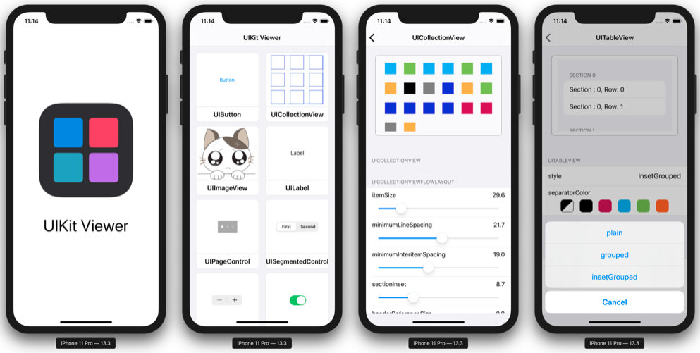
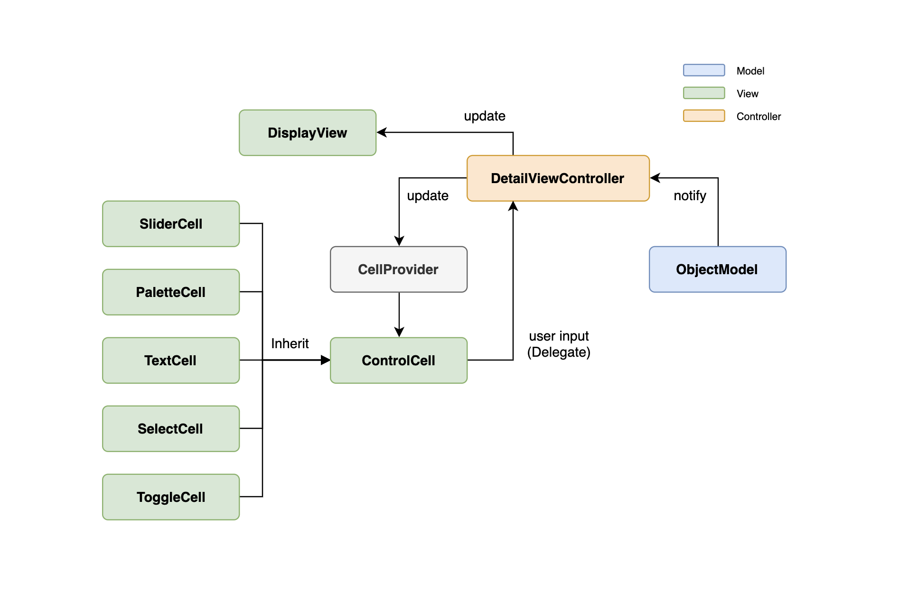

# UIKit Viewer

## Description

- UIKit Framework에 있는 UI 객체들의 속성과, 그 속성을 변경했을 때 UI 변화를 관찰할 수 있는 공부용 앱
- Duration : 2020.02.05 ~ 2020.02.07



## Using Skills

- Swift

## Architecture

- 프로젝트 유지보수성을 향상시키기 위해 **MVC Pattern** 적용 시도
- **Delegate Pattern**을 사용하여 custom cell에서 발생한 사용자 입력을 controller로 전달하여 display view로 update



- `ObjectModel`에서 `String` type의 object 이름을 `NSClassFromString` 함수를 사용하여 실제 object의 metatype을 생성하고 case별로 instance를 생성

  ```swift
  enum ObjectType: String {
    case UIView
    case UILabel
  	// ...
    
    func getInstance() -> UIView? {
      guard let classType = NSClassFromString(self.rawValue) else { return nil }
      switch self {
      case .UIView:
        guard let viewType = classType as? UIView.Type else { return nil }
        let view = viewType.init()
        view.backgroundColor = .gray
        return view
      case .UILabel:
        guard let labelType = classType as? UILabel.Type else { return nil }
        let label = labelType.init()
        label.text = "Test Label"
        label.font = .systemFont(ofSize: 24)
        return label
        
  	  // ...
    }
  }
  ```

- `UITableView`에서 cell 생성을 위한 `CellProvider` 클래스를 생성하고, `CellProvider`가 모든 custom cell의 `register`, `create`를 관장

  ```swift
  class CellProvider {  
    private let tableView: UITableView
    init(tableView: UITableView) {
      self.tableView = tableView
    }
    weak var delegate: ControlCellDelegate?
    
    func create(withProperty name: String, 
                of object: ObjectType, 
                controlType control: CellControlType) -> UITableViewCell {
      self.register(of: control.cellType)
      let controlCell = self.dequeueReusableCell(of: control.cellType)
      controlCell.configure(title: name, from: object)
      controlCell.delegate = self.delegate
      return controlCell
    } 
  }
  ```

- Custom cell들을 subclassing하는 `ControlCell` 객체를 통해 여러 개의 custom tableView cell을 갈아끼우며 사용할 수 있도록 구현

  ```swift
  // Container Class
  class ControlCell: UITableViewCell {
    weak var delegate: ControlCellDelegate?
    func configure(title: String, from object: ObjectType) { }
  }
  
  // Sub Classes
  class SliderCell: ControlCell {
    override func configure(title: String, from object: ObjectType) { ... }
  }
  class SliderCell: ControlCell {
    override func configure(title: String, from object: ObjectType) { ... }
  }
  ...
  ```

- Swift generic, enum, metatype을 활용하여 여러 개의 custom cell을 table view에 register하고 dequeue할 수 있도록 구현

  ```swift
  enum CellControlType {
    case slider, palette, textField, toggle, select
    
    var cellType: ControlCell.Type {
      switch self {
      case .slider:     return SliderCell.self
      case .palette:    return PaletteCell.self
      case .textField:  return TextCell.self
      case .toggle:     return ToggleCell.self
      case .select:     return SelectCell.self
      }
    }
  }
  
  private func register<T: ControlCell>(of type: T.Type) {
    self.tableView.register(
      type, forCellReuseIdentifier: String(describing: type)
    )
  }
    
  private func dequeueReusableCell<T: ControlCell>(of type: T.Type) -> T {
    return self.tableView.dequeueReusableCell(
      withIdentifier: String(describing: type)
    ) as! T
  }
  ```

## What's New

- [Swift Metatype 정리](https://cskime.github.io/2020/02/swift/MetaType/)

- [CaseIterable Protocol 정리](https://cskime.github.io/2020/02/swift/CaseIterable/)